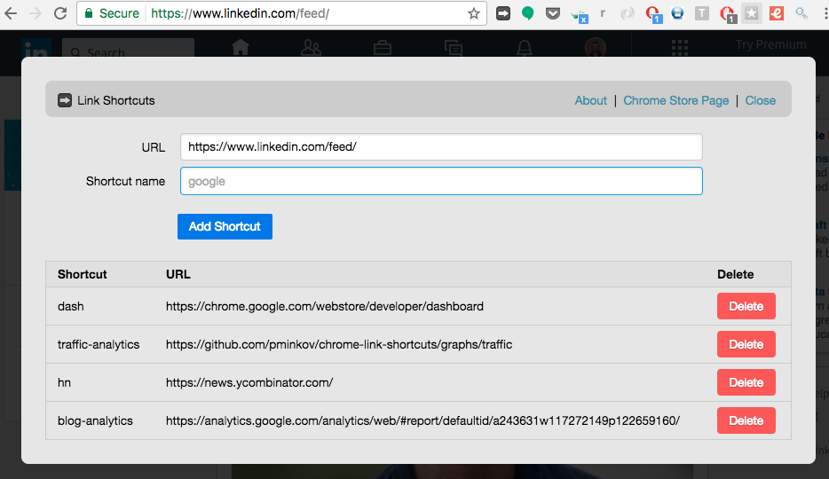

# Google Chrome Extension - Link Shortcuts

### Install
[Chrome Web Store link](https://chrome.google.com/webstore/detail/link-shortcuts/bceohjonbodagliebplenbfjlapegaei).

### Add new shortcuts
To add new shorcuts, click on the browser icon (looks like this: ):

.

You'll be taken to the main UI, where you can add and remove links:

### Go to an url using a shortcut

1. Type "go" and press space/tab.
2. Type the name of the shortcut you'd like to be taken to.

This is how the extension looks like when you use it:

## FAQ

#### Where are link shortcuts stored?

The links are stored in your bookmarks. They're in a directory called "Link Shortcuts" inside the "Other Bookmarks" directory.

#### Is my privacy protected?

Yes, this extension doesn't send any of your data to the author. Everything is stored in your browser and your Google account. This extension is open source, so you can verify this by reading the code as well.
