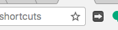
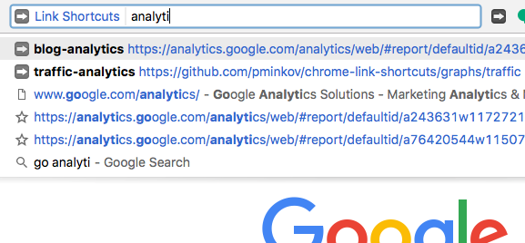

# Google Chrome Extension - Link Shortcuts

To install - [Chrome Web Store link](https://chrome.google.com/webstore/detail/link-shortcuts/bceohjonbodagliebplenbfjlapegaei).

To add new shorcuts, click on the browser icon (looks like this: ):

.

You'll be taken to the main UI, which is fairly self explanatory.

To use the extension:

1. Type "go" and press space/tab.
2. Type the name of the shortcut you'd like to be taken to.

This is how the extension looks like when you use it:

## FAQ

#### Where are link shortcuts stored?

The links are stored in your bookmarks. They're in a directory called "Link Shortcuts" inside the "Other Bookmarks" directory.

#### Do you track what pages I'm visiting?

No. This extension is open source, so you can verify this by reading the code as well.
